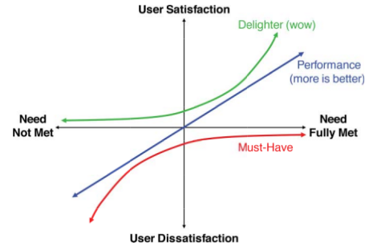
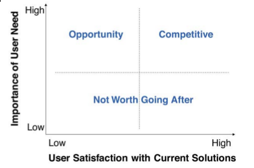

# How to build a product that customers love

This is a summary of the book [Lean Product Playbook](https://www.amazon.com/Lean-Product-Playbook-Innovate-Products/dp/1118960874).

## The process of building a product
1. Create target customer using personas.
1. Prioritise using  the Kano model and Importance vs Satisfaction Framework.
1. Build mock and test with customers. Your customer gives you better feedback in the solution space.
1. Pivot if needed.
1. Build MVP.
1. Launch your product.
1. Use Analytics to improve your product.
1. Use retention rate to measure your product-market fit.
1. Use cohort analysis to measure product-market fit changes over time.
1. After you have good retention, improve other micro metrics using AARRR Framework (Acquisition, Activation, Retention, Referal, Revenue).

## The Product-Market Fit Pyramid

You make hypothesis at each of the layers. You need to test them.

## The Kano Model

## The Importance vs Satisfaction Framewrok

