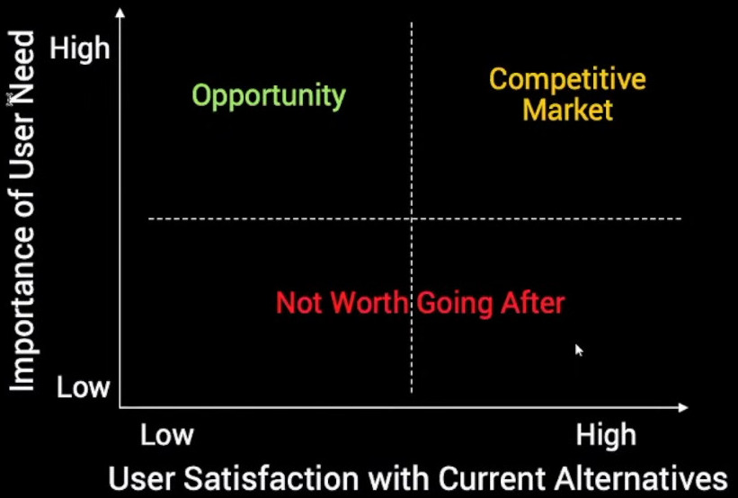

<!-- numbers -->

# How to build a Product That Customers Love

This is a summary of the book [Lean Product Playbook](https://www.amazon.com/Lean-Product-Playbook-Innovate-Products/dp/1118960874) by Dan Olsen.

## 1. The Process of Building a Product
1. Create target customer using personas.
1. Prioritise using the Importance vs Satisfaction Framework ([example](https://buildsuccessfulstartups.com/product-features/)).
1. Build mock and test with customers. Your customer gives you better feedback in the solution space.
1. Pivot if needed.
1. Build MVP.
1. Launch your product.
1. Use Analytics to improve your product.
1. Use retention rate to measure your product-market fit.
1. Use cohort analysis to measure product-market fit changes over time.
1. After you have good retention, improve other micro metrics using [AARRR Framework](https://medium.com/i-want-to-be-a-product-manager-when-i-grow-up/startup-metrics-for-pirates-aarrr-15fe3a38cf2e) (Acquisition, Activation, Retention, Referal, Revenue).

## 2. The Product-Market Fit Pyramid

Start from the bottom. Make hypothesis at each of the layer and test it.

## 3. Prioritizing Needs: Importance vs Satisfaction

This image is not in the book. The author of Lean Product Playbook, Dan Olsen, presented it during [Lean Product & Lean UX Silicon Valley meetup](https://www.youtube.com/watch?v=MSr0hatbSgY).

## 4. Links
* [Example for prioritizing features using the Importance vs Satisfaction Framework](https://buildsuccessfulstartups.com/product-features/)
* [Grow your product with AARRR metrics](https://medium.com/i-want-to-be-a-product-manager-when-i-grow-up/startup-metrics-for-pirates-aarrr-15fe3a38cf2e)
