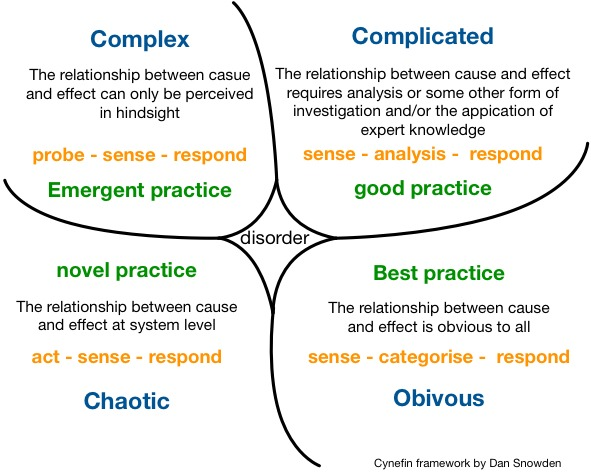

# Solving Challenges With Cynefin

I wanted to share a bit about complexity science and sense-making. Because it's a relatively new field, many leaders are not familiar with tools for dealing with complex/ambiguous challenges. It's a big topic, so I'll just share a framework that I find useful: **Cynefin**. 

## What is Cynefin
Cynefin is a framework for making sense of challenges, depending on how predictable or unpredictable they are. It helps you in deciding on an approach for solving a challenge. Cynefin describes 4 domains: Obvious, Complicated, Complex, and Chaotic. In order to be brief, I'll focus on the Complicated and Complex domains since they are the most important.

A challenge is **Complicated** if the array of solutions is known and you can bring experts to solve it. For example - sending a rocket to the moon or fixing a car. It might be hard but can be done in a top-down manner (traditional project management). 

A challenge is **Complex** if the solution(s) is not known and requires experiments. Sometimes it also requires adaptation and learning of a group of people. Examples include building a product that delights your customer, geo-political conflict, or raising kids. It's not likely that someone has a checklist that will guarantee solving those challenges. The solution is emergent and not top-down.

## Why should I care?
Leaders who understand complexity science can take advantage of it. Here are 3 ways:

1. Using a top-down approach for Complex challenges. Very often, we believe a challenge to be Complicated when it is actually Complex. We bring in experts and build a detailed plan for solving the challenge. This might lead to analysis paralysis, where we don't solve the challenge and end up wasting resources and time. Think of a time when your organization brought in consultants with an existing change management framework and tried to force a big organizational/cultural change as if it were a project with a known solution.
1. Creating strategies by leveraging the commoditization of technology. Technology goes through phases; it starts in the Chaotic domain and sometimes it moves to the Complex, Complicated, and even to the Clear domain. Let's take compute as an example. 20 years ago we had to rent a rack at a data center, then AWS allowed us to rent compute (EC2), and now you can use serverless (Lambda, Azure Function, etc.). The same applies to electricity, phones, cameras, etc. Understanding this commoditization flow allows leaders to experiment with various product strategies. If you identify a capability or technology that is in the Chaotic or Complex domain, you can try to move it towards the Complicated or Obvious Domain. And this is a potential strategy that you can develop.
1. Generating experiments by introducing chaotic situations. I'll give an example before explaining the technique. Let's say your organization doesn't think outside of the box and you want folks to come up with innovative ideas for a policy, process, or product. You bring folks from engineering, sales, marketing, and finance to a room. Now, instead of asking them to collaborate on innovative ideas, you ask each group to come up with ideas in isolation and later you bring them together to present their ideas. What you did is called a 'shallow dive into chaos'. You deliberately put each group in a chaotic environment. You can imagine the sales folks coming up with ideas that are extremely hard to implement because there was no engineer in the room to guide them. So by providing a safe and chaotic environment you can generate experiments.

## Learn more
* 8-minute video by David Snowden, the guy behind Cynefin: https://www.youtube.com/watch?v=N7oz366X0-8.
* My blog post about generating strategies using Cynefin and Wardley Maps: https://oren.github.io/articles/wardley-maps. Wardley Maps is another useful tool for untangling complexity.
