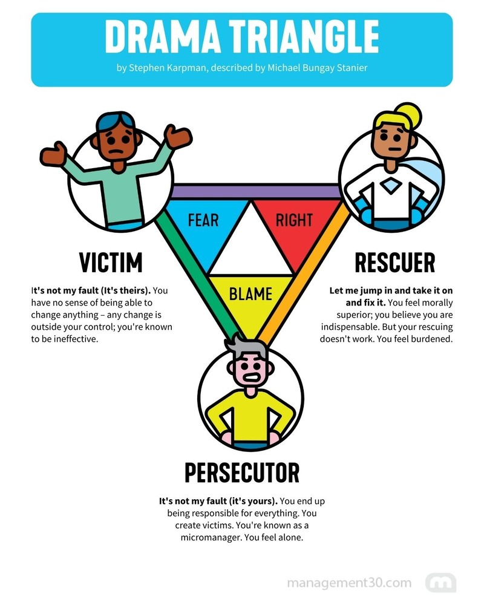

# How to get off the Drama Triangle

Stephen Karpman mapped the three roles people fall into during a conflict:
Victim, Persecutor, Rescuer. The roles feed each other. A Persecutor needs a
Victim, a Victim attracts a Rescuer, and a Rescuer who gets no gratitude turns
into a Persecutor. Nobody solves anything, and everyone leaves tired.

David Emerald's Empowerment Dynamic gives each role an exit: Creator,
Challenger, Coach. Here is how I use it in the moment.

## 1. Pause

Tension spikes, your body goes to fight-or-flight, and you land on the triangle
before you notice. Stop talking. Take a breath. The pause is the whole move.
You cannot pick a role while you are already playing one.

## 2. Name your corner

Ask yourself which one you slipped into:

* Feeling helpless, or blaming circumstances? **Victim**.
* Attacking, criticizing, pointing fingers? **Persecutor**.
* Taking over, fixing it for them? **Rescuer**.

## 3. Swap the role

* **Victim to Creator.** What is one thing you control right now?
* **Persecutor to Challenger.** Drop the attack on the person. State the
  boundary or the request.
* **Rescuer to Coach.** Stop doing the work. Ask a question instead:
  "How do you plan to tackle this?"

Rescuer is the hardest one to leave. Helping feels good, and holding back feels
like abandoning someone.

## 4. Re-engage

Say out loud what was happening, then aim at the problem rather than the
person:

> "I noticed we were going back and forth on whose fault it is. Can we reset
> and look at how to fix X together?"

Naming the pattern usually lands better than I expect. Most people know the
loop they are in and are relieved someone stopped it.

## Links

* [Karpman drama triangle](https://en.wikipedia.org/wiki/Karpman_drama_triangle)
* [The Empowerment Dynamic](https://powerofted.com/)
* Image above: [Management 3.0](https://management30.com/)
