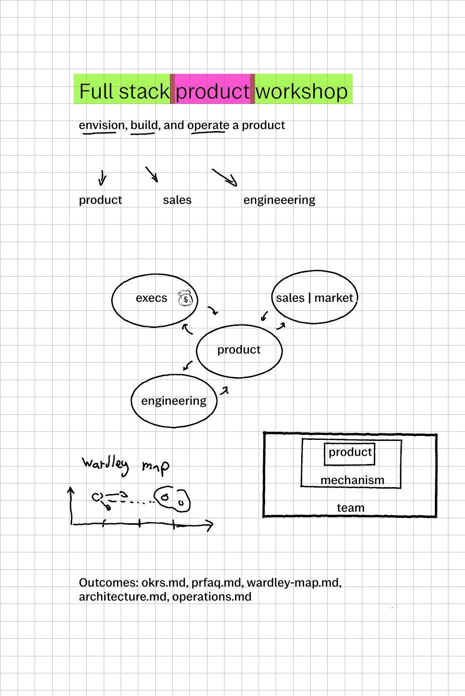

# Full stack product manager workshop

## Learning objectives
During the 3 hours workshop you will write the core building blocks of a product: OKRS.md, FRFAQ.md, wardley-map.md, architecture.md, operations.md
