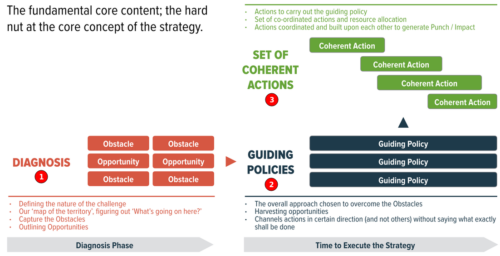

<!-- numbers -->

# How to create a good strategy?

## 1. What is a strategy?
A strategy have 3 components:
* Diagnosis - what's the nature of the problem?
* Guiding Policies - our basic approach to solve the problem.
* Actions - implementation details of the policies.

## 2. What is a good strategy?
Two aspects of a good strategy:
1. It coordinates policy and actions using objectives.
2. It enables new strength through subtle shifts in viewpoints.

Advantages such as being a first mover, scale, scope, network effects, reputation, patents, brands, and many others are useful but they don't make a strategy good.

## 3. Sources of power
*Note: This section is under development*

* Using leverage
* Proximate objectives
* Chain-link systems
* Using design
* Focus
* Growth
* Using advantage
* Using dynamics
* Inertia and entropy

## 4. Examples of a Bad Strategy

### Strategy A:

* Challenge: 40% of students in LA are dropping out. How to improve it?
* Actions: let's hire better teachers or let's buy better books.

This is not a strategy since it's doesn't include a diagnosis of the probelm and also missing a guiding policy.

### Strategy B:

* Challenge: Greece borrowed more money than they can pay back. How to prevent that in the future?
* Actions: bail out the banks, do a better math before borrowing money or don't anticipate growth if there was no growth in the last 10 years.

This is not a strategy since it's doesn't include a diagnosis of the probelm and also missing a guiding policy.

## 5. Examples of a Good Strategy
*Note: This section is under development*

## 6. Good Strategy Bad Strategy Book

### Table of contents

Part 1: Good and bad strategy
* Chapter 1: Good strategy is unexpected
* Chapter 2: Discovering power
* Chapter 3: Bad strategy
* Chapter 4: Why so much bad strategy?
* Chapter 5: The kernel of good strategy

Part 2: Sources of power
* Chapter 1: Using leverage
* Chapter 2: Proximate objectives
* Chapter 3: Chain-link systems
* Chapter 4: Using design
* Chapter 5: Focus
* Chapter 6: Growth
* Chapter 7: Using advantage
* Chapter 8: Using dynamics
* Chapter 9: Inertia and entropy
* Chapter 10: Putting it together

Part 3: Thinking like a strategist
* Chapter 1: The science of strategy
* Chapter 2: Using your head
* Chapter 3: Keeping your head.

### Resources
* ['Good Strategy Bad Strategy' Book](https://www.amazon.com/Good-Strategy-Bad-Difference-Matters/dp/0307886239)
* [1 minute video by the Author of 'Good Strategy Bad Strategy'](https://www.youtube.com/watch?v=UZrTl16hZdk)
