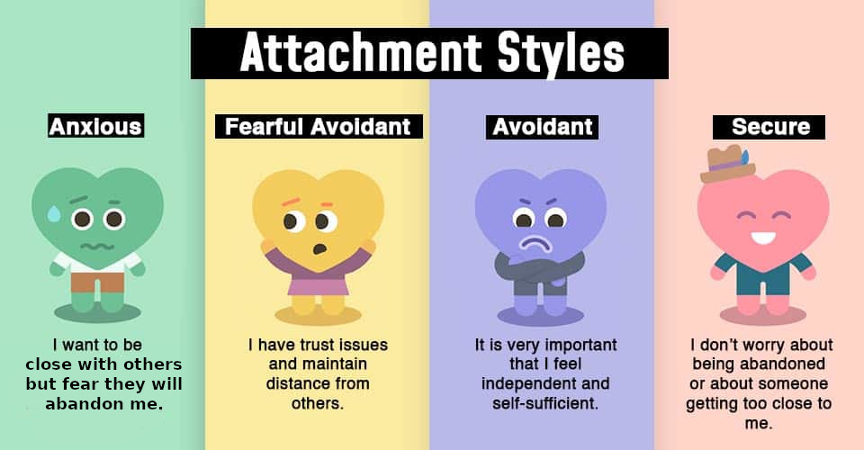

# Help a friend with anxious attachment style

How to help your romantic or platonic friend if your attachment style is secure and their is Anxious? Below are ChatGPT's answers.

## Romantic friend
Having a secure attachment style puts you in a good position to support your partner who has an anxious attachment style. Here are some ways you can help her:

1. **Be consistent and reliable:** As someone with a secure attachment style, you likely value consistency and reliability in relationships. Make sure you consistently show up for your partner, both emotionally and physically. This can help alleviate some of her anxieties about the relationship.
1. **Communicate openly and honestly:** Encourage open communication in your relationship. Let your partner know that she can come to you with her concerns and that you'll listen without judgment. Be honest with her about your feelings and thoughts, as this can help build trust and security in the relationship.
1. **Provide reassurance:** People with anxious attachment styles often seek reassurance from their partners. Offer verbal affirmations of your love and commitment regularly. Let her know that you're there for her and that you care about her well-being.
1. **Set boundaries:** While it's important to be supportive, it's also crucial to set boundaries to maintain your own well-being. Let your partner know what behaviors are acceptable to you and what aren't. This can help prevent any codependent dynamics from forming in the relationship.
1. **Encourage her to seek therapy:** If your partner's anxiety is significantly impacting her life and your relationship, encourage her to seek therapy. A therapist can provide her with tools and strategies to manage her anxiety and work through any underlying issues contributing to her attachment style.
1. **Practice patience and empathy:** Understand that your partner's anxiety is not a reflection of you or your relationship. Practice patience and empathy when she's feeling anxious, and try to understand things from her perspective.
1. **Be mindful of triggers:** Pay attention to things that trigger your partner's anxiety and try to avoid or mitigate them when possible. This could include certain topics of conversation, situations, or behaviors.
1. **Work on building her self-esteem:** Anxious attachment often stems from low self-esteem and fear of abandonment. Help build your partner's self-esteem by offering genuine compliments, supporting her goals and interests, and reminding her of her strengths.

By implementing these strategies, you can support your partner with an anxious attachment style and help strengthen your relationship. Remember, building secure attachment takes time and effort from both partners, so be patient and compassionate as you navigate this journey together.

## Platonic friend
Supporting a friend with an anxious attachment style can be a bit different from supporting a romantic partner, but many of the same principles apply. Here are some ways you can help your friend:

1. **Listen without judgment:** Offer your friend a non-judgmental space to express her feelings and concerns. Let her know that you're there to listen and support her, without trying to fix her problems or dismiss her feelings.
1. **Provide reassurance:** Similar to supporting a romantic partner, providing reassurance can be helpful for a friend with an anxious attachment style. Remind her that you value her friendship, and reassure her of your loyalty and support.
1. **Encourage professional help:** If your friend's anxiety is significantly impacting her life or relationships, encourage her to seek professional help. A therapist can provide her with tools and strategies to manage her anxiety and work through any underlying issues contributing to her attachment style.
1. **Set boundaries:** While it's important to be supportive, it's also crucial to set boundaries to maintain your own well-being. Let your friend know what behaviors are acceptable to you and what aren't. This can help prevent any codependent dynamics from forming in the friendship.
1. **Be consistent and reliable:** As someone with a secure attachment style, you likely value consistency and reliability in relationships. Make sure you consistently show up for your friend, both emotionally and physically. This can help alleviate some of her anxieties about the friendship.
1. **Encourage self-care:** Remind your friend of the importance of self-care and encourage her to engage in activities that help reduce her anxiety. This could include things like exercise, meditation, spending time with loved ones, or pursuing hobbies and interests.
1. **Educate yourself:** Take the time to educate yourself about anxious attachment styles and how they can impact relationships. This will help you better understand what your friend is going through and how you can best support her.
1. **Be patient and empathetic:** Dealing with anxiety can be challenging, so practice patience and empathy with your friend. Try to understand things from her perspective and offer your support without judgment.

By implementing these strategies, you can support your friend with an anxious attachment style and help strengthen your friendship. Remember that being there for her consistently, providing reassurance, and encouraging her to seek professional help when needed are all important ways to support her on her journey toward greater emotional well-being.

## Resources
* What's your attachment style, a 5 minute test: https://www.attachmentproject.com/attachment-style-quiz/

