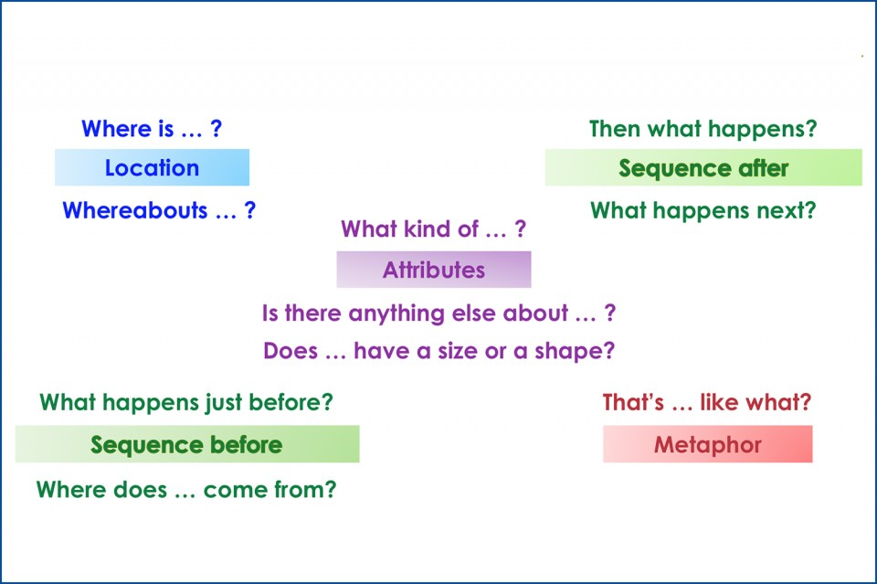

# How to facilitate meaningful conversations

## Problem / Opportunity
You joined a new team or organization and have one-on-ones with 25 people in 10 days. How do you connect with people, build trust, and learn about their world? How do you accomplish that in a 30-minute conversation?

## Solution
Create a psychologically safe environment by using a technique called [Clean Language](https://unconsciousagile.com/articles/clean_language). When the other person shares something that you want to learn more about, ask a question in a way that allows them to use their own vocabulary and metaphors.

### Example for a clean conversation
Let's see an example of using Clean Language techniques in conversations.

You: What challenges are important for the team?

Them: the team needs a testing environment.

Non-clean answer: What kind of software do you need? (don't use words the person didn't use. Let them come up with the vocabulary).

Clean answer: What kind of testing environment?

Them: my head explodes when I try to test our services together with it's dependent services.

Non-clean answer: does it frustrate you? (don't guess their emotions, let them share their world in their own language and metaphors).

Clean answer: and then what happened?

Them: Last week we had a production outage that impacted our customer and our testing environment didn't detect that.

## What is Clean Language?
Communication methodology that was Developed in the 80' by David Grove, a psychologist. The idea is to remove biases from a conversation by not using your own language and metaphors.

Use the following questions, depends on where you want to focus the conversation on:

