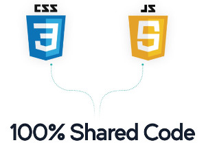

# Build Mobile apps with Dockrized NativeScript



[NativeScript](https://www.nativescript.org) is an interesting way to build Android and iOS apps using Javascript.

Let's look at some alternatives:
* **Phonegap** uses the DOM. NativeScript uses native UI controls.  
* **Xamarin and Titanium** compile C# and JavaScript to Objective-C and Java respectively. In NativeScript the JavaScript you write is running on your phone.  
* **React Native** only compiles to iOS (at the moment) and doesn't provide direct access to the native API.

Here is an example using the native Android API:
``` js
var file = new java.io.File(path);
```

NativeScript uses the V8 (and Webkit for iOS and Windows) which injects a few global objects. In the above example, `java.io.File` is one of them. In order to access Java objects, NativeScript uses something called Android JNI which provides a bridge between C++ and Java.
`file` then becomes a proxy object that points to a Java Object.
Is there any performance penalty here? Indeed, but it's only %10 precent slower than native applications.

Two more interesting points about NativeScript:

* NPM and CommonJS friendly - if you use Node.js you will feel at home.
* CSS for styling - you can use regular CSS syntax for styling your UI.

I wanted to explore NativeScript but didn't want to install and configure Java, Android SDK, Ant, etc. Life is too short so I created a Docker container with everything needed to run it.

[Try it](https://github.com/oren/docker-nativescript) and let me know what you think!


