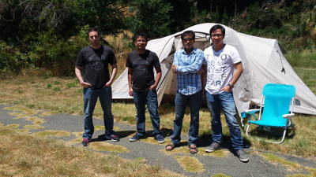

<meta property="og:title" content="NodeConf" />
<meta property="og:image" content="images/tent.jpg" />

# NodeConf

Sometimes a tweet speaks louder than words:

My experience at Nodeconf (5 minutes video):

<iframe width="560" height="315" src="https://www.youtube.com/embed/XZjO2cqNfH4" frameborder="0" allowfullscreen></iframe>
