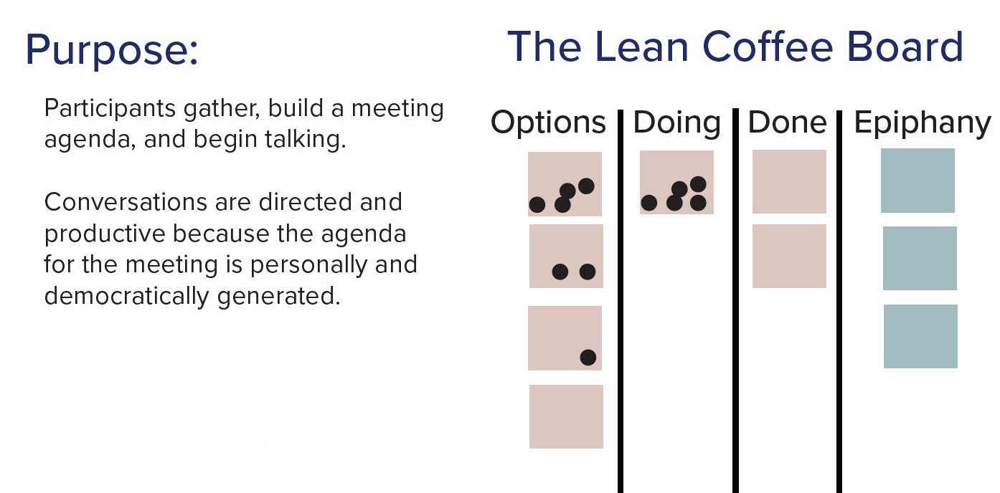

# Reveal What Matters

## 1. Challenge
You are a leader of a large organization. You know that strategies that came from the team members themselves are more likely to stick since the team will own them. How do you encourage the team to come up with successful strategies?

## 2. Solution
Encourage the team to setup a one hour meeting with no managers to discuss the most important topics. The outcome of the meeting are list of insights and action items.

## 3. How
Ask a team member to volunteer to facilitate the meeting by using the [Lean Coffee](https://hohmannchris.wordpress.com/2017/06/28/what-is-lean-coffee/) technique. Ask the facilitator to invite all non-manager in the organization (as optional) to the meeting and ask them to present you the insights/action items from the meeting without revealing who said what. You want to focus on the ideas that came out of the meeting and not on the individuals.

