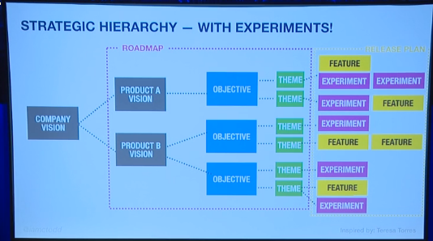
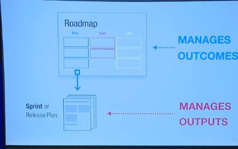

<!-- numbers -->

# How to set the direction of your organization

This is a summary of the book [Product Roadmap Relaunched](https://www.amazon.com/Product-Roadmaps-Relaunched-Direction-Uncertainty/dp/149197172X).

## 1. What is an organization roadmap?
Set of business objectives that are driven by customer needs. It's a tool for communicating and testing your strategy with customers and stakeholders.

## 2. What is the value of a roadmap?
It aligns the organization towards shared objectives. It is relatively stable because it focuses on the problem space instead of the solution space (product features).

## 3. How to build a roadmap?
1. Gather customer needs and come up with objectives (OKRs)
2. Organize into themes
3. Place into time-frames (Q1, Q2, etc)

Drive the product release plan from each theme.

## 4. Resources:

* [Summary](https://www.mindtheproduct.com/roadmaps-are-dead-long-live-roadmaps-by-c-todd-lombardo/) (30 min video)
* [Conversation with Bruce McCarthy, author of Roadmapping Relaunched, and Dan Olsen, author of Product Lean Playbook](https://www.youtube.com/watch?v=MP3-IEePSas) (40 min video)
* [Summary](https://www.productplan.com/product-roadmaps-relaunched/) (10 min read)
