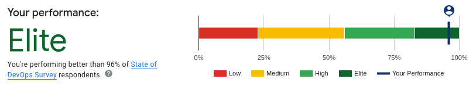

# How to measure software delivery performance in a minute

## 1. What is DORA?
The DevOps Research and Assessment (DORA) team is a research program that was acquired by Google in 2018. Their goal is to understand the practices, processes, and capabilities that enable teams to achieve high performance in software and value delivery.

## 2. How can I measure it in 1 minute?
Before spending weeks to build up sophisticated dashboard tooling, consider just regularly taking the [DORA quick check](https://www.devops-research.com/quickcheck.html) in team retrospectives. This gives the team the opportunity to reflect on which [capabilities](https://www.devops-research.com/research.html#capabilities) they could work on to improve their metrics, which can be much more effective than overdetailed out-of-the-box tooling.

## 3. What's in the test?
Deployment frequency (DF), lead time for changes (LT), mean time to recovery (MTTR), and change failure rate (CFR).

## Dive Deeper
The origin of the DORA research program is a book titled [Accelerate](https://www.amazon.com/Accelerate-Software-Performing-Technology-Organizations/dp/1942788339/ref=asc_df_1942788339/?tag=hyprod-20&linkCode=df0&hvadid=312060980065&hvpos=&hvnetw=g&hvrand=2980652452972303210&hvpone=&hvptwo=&hvqmt=&hvdev=c&hvdvcmdl=&hvlocint=&hvlocphy=9060414&hvtargid=pla-446149606248&psc=1). Here is a [summary](https://tdevroome.medium.com/book-summary-accelerate-c531efe4c34c).

I love the guidelines for creating High-Performance Leadership & Management:
- Develop and maintain a mindset of shared learning
- Don't copy models or contract out - develop your own coaches and models right for your organization
- You need to change along with your business
- Practice discipline
- Practice patience
- Learn by doing, repeatedly, and incrementally evolving based on learning outcomes

