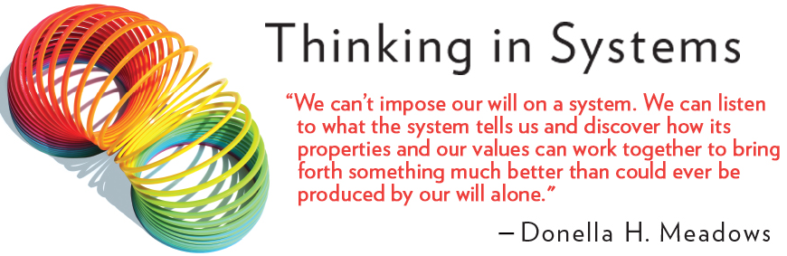

# Notes on System Thinking

I am listening to the audio book [Thinking in Systems: A Primer](1) and use this page to capture any insights.

## Leverage Points: Places to Intervene in a System
Chapter 6 talkes about places to intervene in a system. [Here is a blog post about that](2) and here are the leverage points:

(sorted my most effective to least)

1. The power to transcend paradigms.
1. The mindset or paradigm out of which the system — its goals, structure, rules, delays, parameters — arises.
1. The goals of the system.
1. The power to add, change, evolve, or self-organize system structure.
1. The rules of the system (such as incentives, punishments, constraints).
1. The structure of information flows (who does and does not have access to information).
1. The gain around driving positive feedback loops.
1. The strength of negative feedback loops, relative to the impacts they are trying to correct against.
1. The lengths of delays, relative to the rate of system change.
1. The structure of material stocks and flows (such as transport networks, population age structures).
1. The sizes of buffers and other stabilizing stocks, relative to their flows.
1. Constants, parameters, numbers (such as subsidies, taxes, standards).

[1]: https://www.amazon.com/Thinking-Systems-Donella-H-Meadows/dp/1603580557
[2]: https://donellameadows.org/archives/leverage-points-places-to-intervene-in-a-system/
