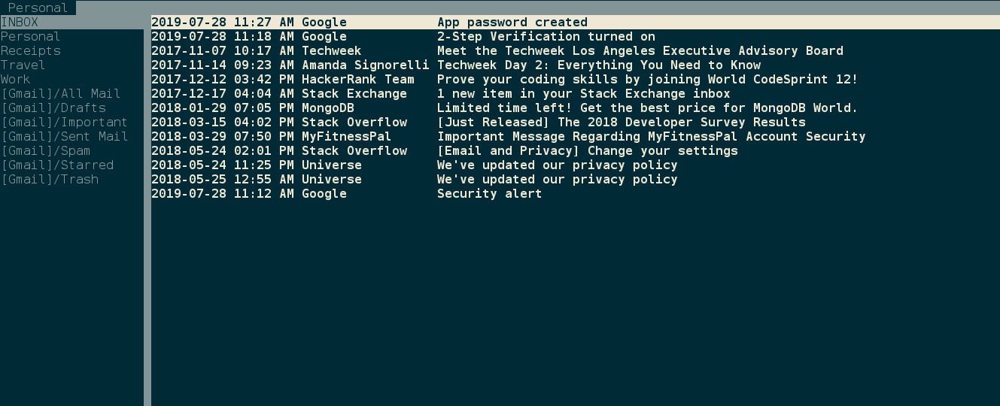

# Text-Based Email



## 1. What is this page?
A step by step guide for setting up Gmail with a text-based email client called [aerc](https://aerc-mail.org/).


## 2. Install
I didn't tested it but this guide should works on Mac and [Windows](https://docs.microsoft.com/en-us/windows/wsl/install-win10) as well.

```
cd ~/
git clone https://git.sr.ht/~sircmpwn/aerc
cd aerc
make
sudo make install
```

## 3. Configure
Run `aerc`

Running it for the first time will ask you a bunch of questions. Answer the following:
(tab and shift tab to move around, enter to pick option)

* Name for this account: Personal
* Full name for outgoing emails: John Doe
* Your email address: jonhdoe@gmail.com

Configure incoming mail (IMAP)

* Username: jonhdoe@gmail.com
* Password: secretpassword
* Server address: imap.gmail.com:993
* Connection mode: IMAP with STARTTLS

Configure outgoing mail (SMTP)

* Username: jonhdoe@gmail.com
* Password: (skip this)
* Connection mode: Insecure SMTP
* Copy sent messages to 'Sent' folder: No

There is one more thing you should do in order to make it work - you need to get a special password for this app from Google. After you get it, you should replace it in the configuration file ~/.config/aerc/accounts.conf

Follow the steps on [this Googles page](https://support.google.com/accounts/answer/185833) to generate that password. Google calls it App Password.

## 4. Run
Run `aerc` again

## 5. Basic Commands

* Move between emails: j/k
* Move between folders: shift j/k
* View email: enter
* Go up and down when reading an email: j/k, Page up/down, arrows, g/GG
* Back to email list: q
* Delete email: :delete
* Compose email: C
* Send email: :q
* Reply: Rr
* Reply All: rr

## 6. HTML Email
HTML emails will show the html tags. To make things pretty use [w3m](http://w3m.sourceforge.net/) browser. Do that by adding this line in aerc.conf: `text/html=/usr/bin/w3m -T text/html -o display_link_number=1`. Add it above this line: `text/*=awk -f /usr/local/share/aerc/filters/plaintext`.

Now whenever you open an HTML email, you won't see the html tags. Instead it will be rendered using w3m.

## 7. Don't break lines
Vim automaticaly wrap lines after 80 characters. This will cause the lines in your emails to be broken. Here is how to fix it.
```
mkdir -p .config/nvim/after/ftplugin
vim .config/nvim/after/ftplugin/mail.vim
```
Add this line to mail.vim: `set formatoptions-=t`

## 8. Google Contacts
How to find your contacts without opening the browser? [Goobook](https://www.ostechnix.com/goobook-access-google-contacts-commandline-linux/).

## 9. Get Help
* Help Pages: `man aerc`, `man aerc-tutorial`, and `man aerc-config`
* [Search for ticket or submit new one](https://todo.sr.ht/~sircmpwn/aerc2)
* [Chat](https://webchat.freenode.net/#aerc)


