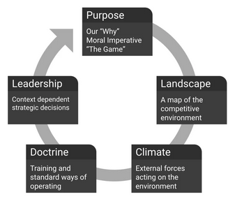
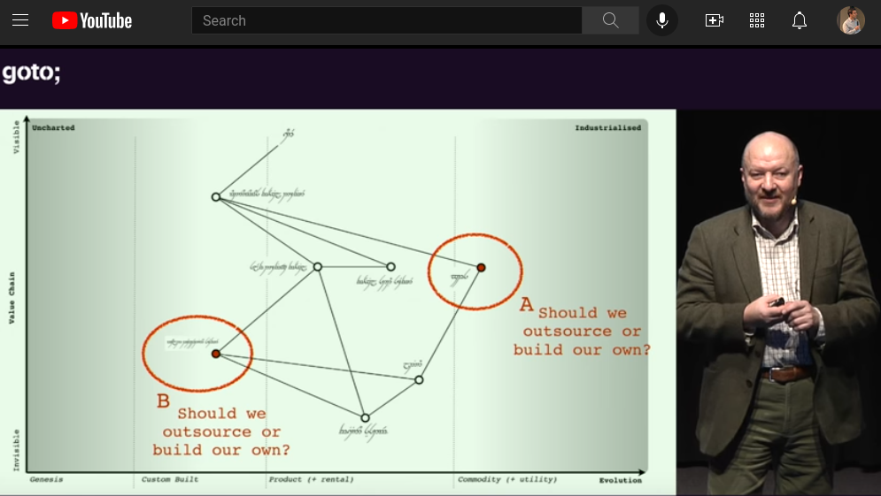
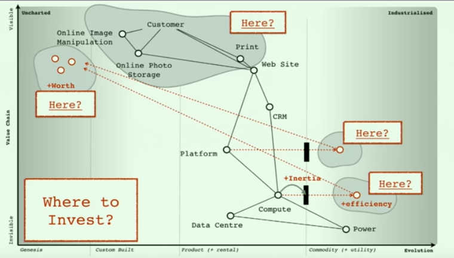
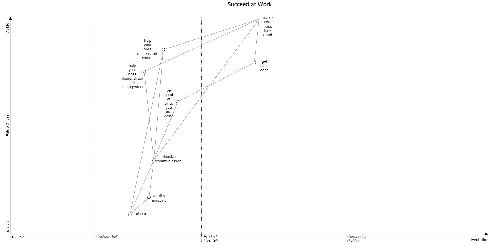

<!-- numbers -->

# Wardley Maps

## 1. What are Wardley Maps?

The process of making strategic decisions (leadership) based on the purpose (“the game”), a description of the competitive landscape (a map), the external forces acting on the landscape (climate), and the training of your people (doctrine).

Looping through the strategy cycle ([OODA loop](https://en.wikipedia.org/wiki/OODA_loop)):

## 2. What Can You Do with Wardely Maps?

### Decide Between Outsuorcing and Building Your Own

Without the x and the y (a map), it's hard to tell what to do with A and B:

With a map, it make sense to outsource A and build B:

There is much more you can do with them. I'll add more examples soon.
### Where to Invest?

Compute (renting compute from a public cloud vendor) and platform (deploy tools and programming languages) are moving toward commodization. Should you build a compute or platform (genesis/chaotic) or wait until you can buy from a vendor (commodity/simple)? Generate experimental strategies, debate their impact with the team and test your assumptions as fast as possible.
.

## 3. How to Start with Wardley Maps?
Pick a user and write down one of their needs. Than write down what capabilities are required to achieve that need.

Example of a map. You are the user and your need is to be successful at work:

If you want a deeper learning package:
1. [Situational awareness](https://learnwardleymapping.com/introduction/). 5 min video.
2. [Tutorial (click on 'Next Section')](https://learnwardleymapping.com/introduction/). 20 min read.
3. [Draw your first map](https://learnwardleymapping.com). 10 min video.
4. [Official Book](https://learnwardleymapping.com/book/). 14 hours audio/read. You can choose between reading from a website, a pdf, or audio. If you can read and listen on your laptop at the same time, it will be optimal since there are a lot of visuals.

## 4. Links:
* [Getting Started](getting-started/) (5 minute workshop)
* [30 min video - Crossing the River by Feeling the Stones - Simon Wardley](https://www.youtube.com/watch?v=2IW9L1uNMCs)
* [Youtube Channel](https://www.youtube.com/c/HiredThought/videos)
* [Online Wardley Maps](https://onlinewardleymaps.com/)
* [Community Hub](https://list.wardleymaps.com/)
* [Website](https://learnwardleymapping.com/)
* [Twitter](https://twitter.com/search?q=%23WardleyMaps)

## 5. Book
Wardley Maps - Topographical intelligence in business

On Being Lost (28m read)

Finding a Path (24m read)

Exploring the Map (23m read)

Doctrine (33m read)

The Play and a Decision to Act (35m read)

Getting Started Yourself (20m read)

Finding a New Purpose (39m read)

Keeping the Wolves at Bay (26m read)

Charting the Future (33m read)

I Wasn’t Expecting That! (41m read)

A Smorgasbord of the Slightly Useful (72m read)

The Scenario (14m read)

Something Wicked This Way Comes (19m read)

To Thine Own Self Be True (12m read)

On the Practice of Scenario Planning (34m read)

Super Looper (38m read)

To Infinity and Beyond (24m read)

Better for Less (37m read)

On Playing Chess (27m read)

This book is in a [website format](https://medium.com/wardleymaps/on-being-lost-2ef5f05eb1ec), [audio format](https://feststelltaste.github.io/wardley-maps-audiobook/), and a [pdf format](https://raw.githubusercontent.com/HiredThought/wardley-maps-ebook/main/bin/Wardley%20Maps%20-%20Simon%20Wardley.pdf). I suggest to listen and read at the same time since there are various visuals in the pdf.
