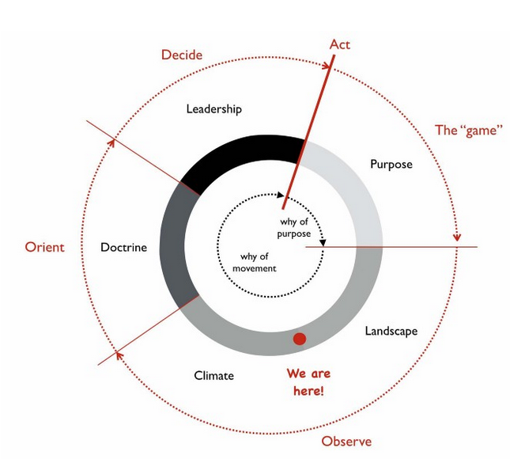

<!--
size: 4:3
theme: default
-->

## Create strategies using Wardley Maps

---
<!-- paginate: true -->

## What will you learn?

- How to draw your first map
- How to use the map to make strategic decisions
- How to include your team to this process

---

## All the steps in one page
1. Write a customer, need, and dependency
1. Draw a map
1. Move the dependencies
1. Add trends to the map
1. Add moves to the map
1. Add strategic moves
1. Decide on actions

---

## 1. Write down a customer, need, and dependency

Steps:
1. write down name of a customer.
1. Write one need of this user.
1. Write something that depends on that need.

Example:
1. user: software engineer.
1. need: building a web service.
1. dependency: choose a technology.

---

## 2. Draw a map

TODO: add drawing

---

## 3. Move the dependencies

Use this diagram:

TODO: add evolution/landscape diagram

---

## 4. Add trends to the map

Add to the map:
TODO: add climate diagram

---

## 5. Add moves to the map

Add this to the map:
TODO: add doctrine (orient) chart

---

## 6. Add strategic moves

---

## 7. Take actions

---

## Invite your team

---

## Here is the cycle you went through:

---

## Repeat the cycle

Repeat this strategy cycle with the team every few weeks.

---

## Next Steps (optional)

- If you want to dive deeper into Wardley Maps watch [Introduction to Wardley Maps]() (30 min video).
- If you want to dive deeper into strategy and organizational development [introduction to strategy and organizational development]() (30 min video).

