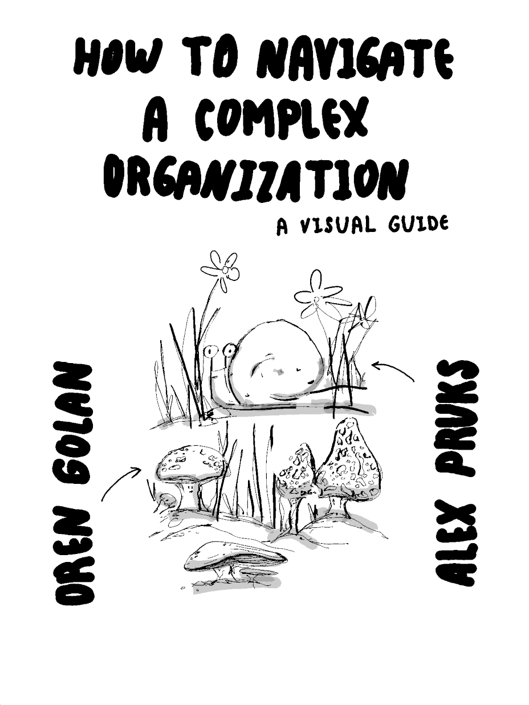
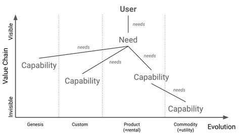
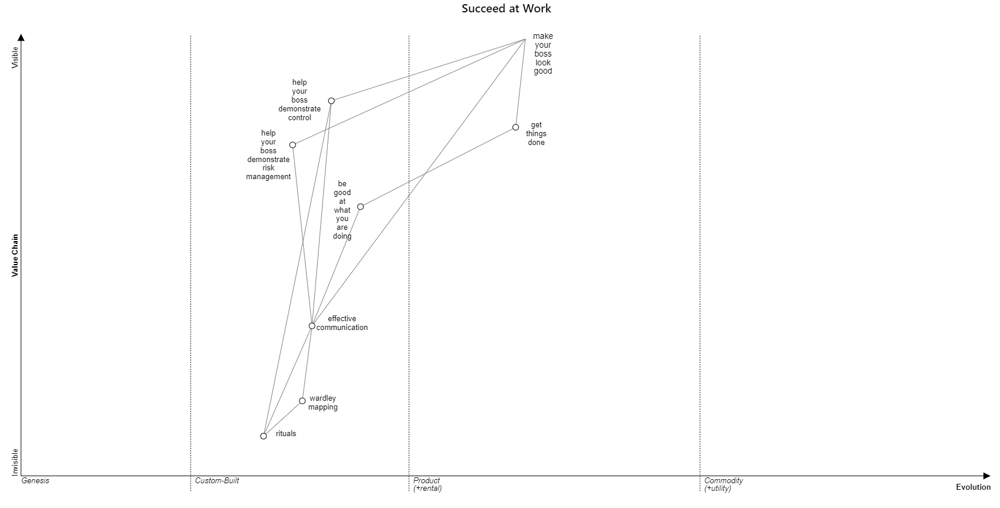
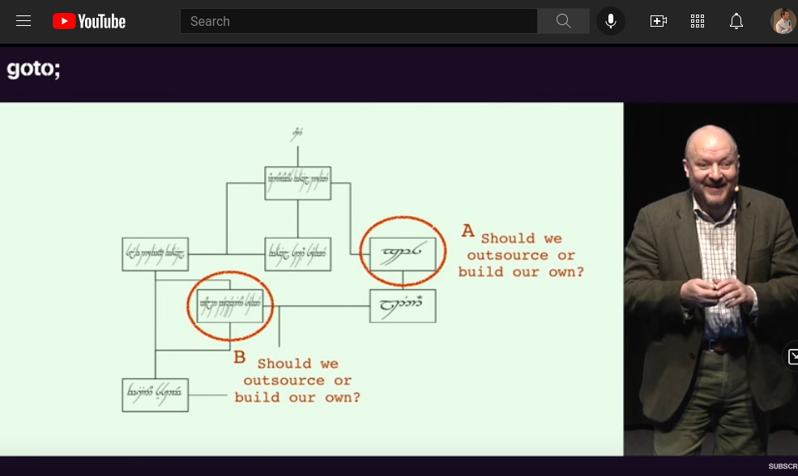
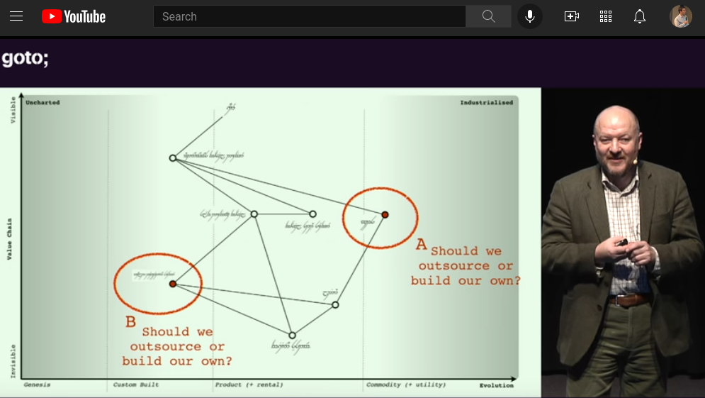

<!--
theme: uncover
paginate: true
size: 4:3
-->

---

## What will you learn?

* foo

---

## Agenda

* What
* Why

---

## What Are Wardley Maps?
The process of making strategic decisions (leadership) based on the purpose (the "game"), a description of the competitive landscape (a map), the external forces acting on the landscape (climate), and the training of your people (doctrine).

---

## Here is a Map

---

## Why Using Wardley Maps?
Build strategy with more people in your organization and create a shared vocabulary on the business and it's environment.

---

## Strategy Cycle
Wardley Maps suggests to cycle through 5 phases that are ispired by the book [Art of War](https://en.wikipedia.org/wiki/The_Art_of_War) and [OODA loop](https://en.wikipedia.org/wiki/OODA_loop):

---

## How
Pick a customer and a need they have. list the capabilities that are needs to address that need. Now draw a simple map. Don't worry too much if it's not accurae. Have fun!

---

## foo
Here is an example of a Wardley Map. Try to understand it without explanation. Imagine how many sentences it will take to describe all the insights you get from this map.

---

## bar
You don't have to agree with everything on that map. The improtant thing is to start a discussion with various people in your organization.

---

## boo
Here is an example of how Wardley Map can help you. Should you outsource something or build it your self?

---

Outsource or Build?

---

Outsource or Build?

