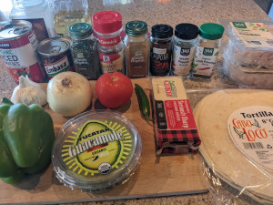
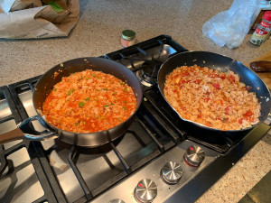
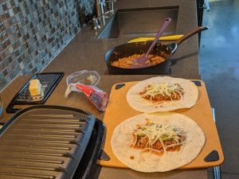

# Cholent

**Ingredients:** (ordered by usage)

* Ground turkey or chicken, onion, garlic
* Chipotle peppers in adabo sauce, tomatoe sauce, salt, chipotle smoked red jalapenos, parsley, cayene, chilli powder
* Tortillas, cheese, guacamole

**How to make it:**

* Add a little bit of oil on a skilet, add chicken or turkey and wait a few minutes until cooked.
* Add onion and garlic.
* After a few minutes add everything else.
* Lay everything on a tortilla, add cheese and guacamole, wrap it and grill for a few minutes.
