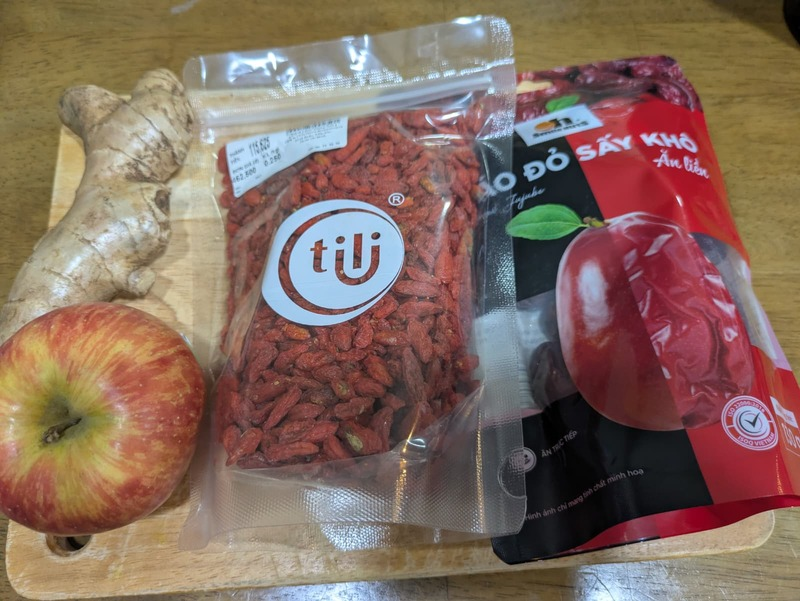
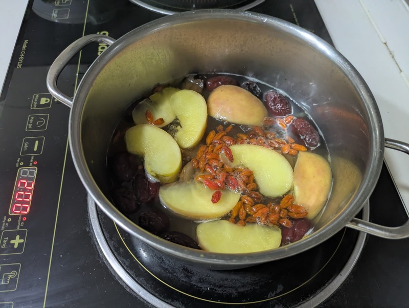
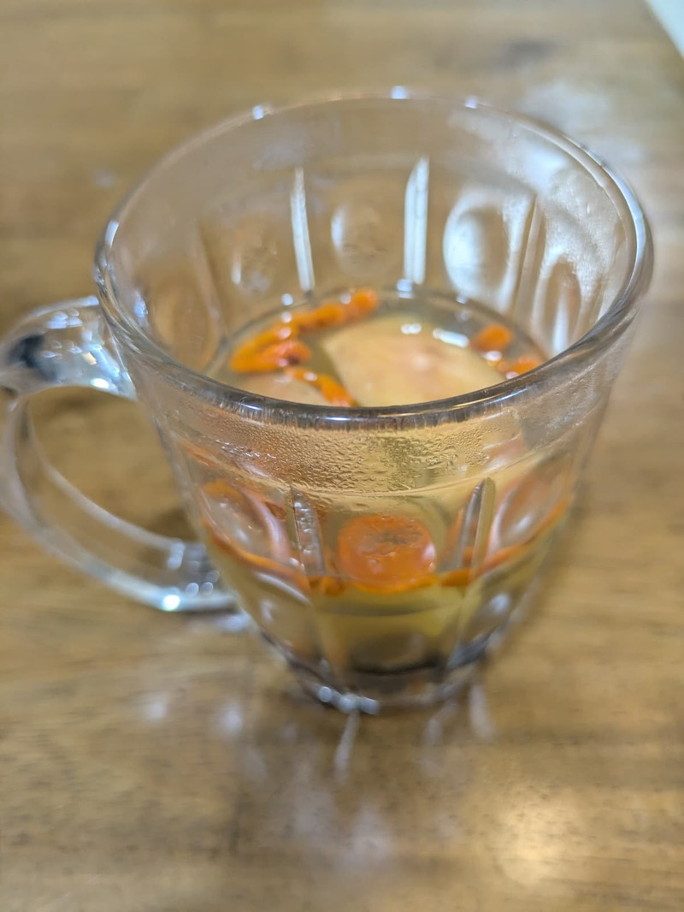

# Apple red date ginger tea (Trà táo đỏ kỷ tử táo tươi)

**Summary**

Prep time: 5 mins | Cook time: 20 mins | Total time: 25 mins | Servings: 3

**Ingredients:**

- 1 apple, cored and cut into wedges
- 8 dried red dates (jujube)
- 2 tbsp goji berries
- 1 inch ginger, sliced thin

**Instructions:**

1. Rinse the red dates and goji berries. Core the apple and cut it into wedges, skin on. Slice the ginger thin.
2. Put the apple, red dates, and ginger in a pot with 1 litre of water and bring to a boil.
3. Lower the heat and simmer for 15 minutes, until the apple is soft and the dates have plumped up.
4. Add the goji berries and simmer 5 minutes more. Any longer and they go mushy.
5. Serve hot, fruit and all. The dates carry enough sweetness that it needs no sugar.
