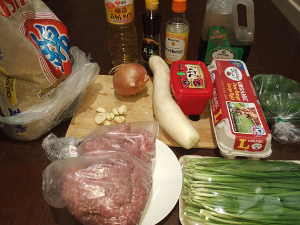
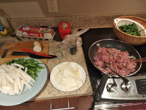

# Not a Bibimbap

**Ingredients:**

* Pork, rice, eggs, veggies, mushrooms, soy sauce, sesame oil, sake, and whatever you recognize in the picture (:

**How to make it:**

1. Cut everything
1. Cook the veggies and the pork on a pan
1. Make rice separately
1. Cook a few eggs on a pan

Good Job. You are awesome!

Note: another version, in instant pot: https://www.instagram.com/reel/C-oEqffyJ7t/?igsh=MXRhZncycWV6ZXQ2Zw==
