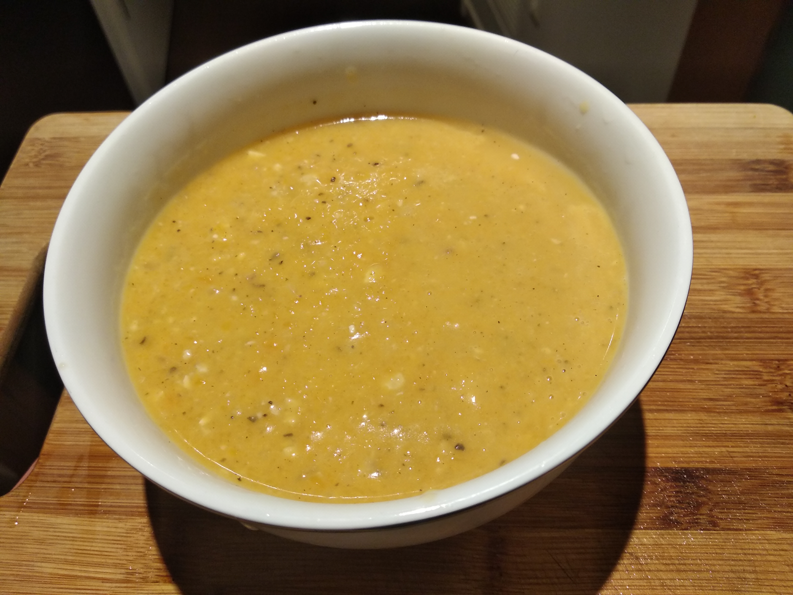

## Butternut Squash Soup

**Summary**

Easy to make, spicy and healthy soup. 8 min in an instant pot. I copied it from [this recipe](https://www.gimmesomeoven.com/instant-pot-butternut-squash-soup).

**Ingredients:**

* 2 cups vegetable/chicken stock
* 4 cloves garlic, peeled and minced
* 1 carrot, peeled and diced
* 1 Granny Smith apple, cored and diced (or tablespoon apple cider vinegar)
* 1 medium (uncooked) butternut squash*, peeled, seeded and diced
* teaspoon of sage powder (or 1 sprig fresh sage)
* 1 white onion, diced
* 1 teaspoon salt, or more to taste
* 1/2 teaspoon black pepper, or more to taste
* 1/4 teaspoon cayenne, or more to taste
* pinch of ground cinnamon and nutmeg
* 1/2 cup canned (unsweetened) coconut milk
* Optional garnishes: extra coconut milk and a sprinkle of smoked paprika (or cayenne pepper)

**How to make it:**

* Add everything except for the coconut milk to instant pot. cook for 8 minutes.
* Add coconut milk
* Blend it into a soup. Immersion stick is the easiest but any blender/food processor will work.

## Thicker Version
Add potatoe, bay leaves, yellow onion instead of white, and no cinnamon. Serve with pumpkins seeds

