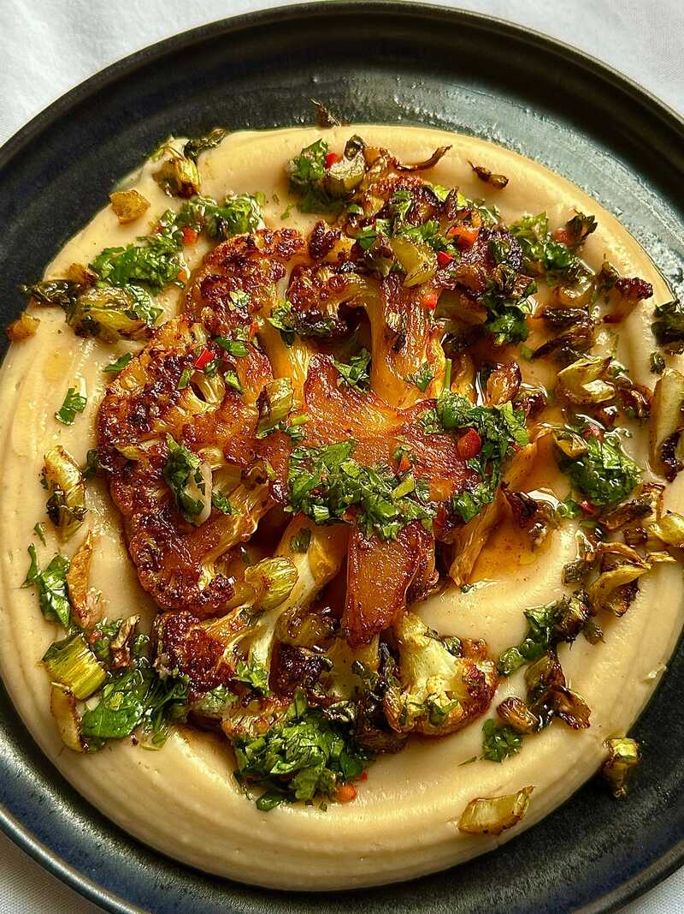
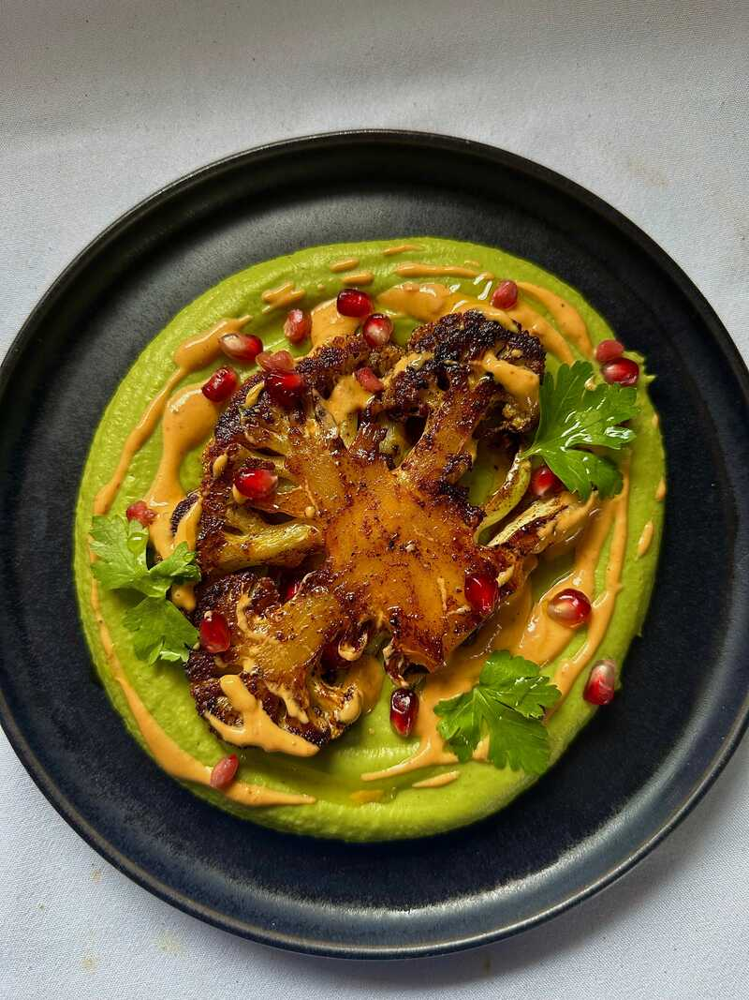

# Cauliflower Chimichurri

## Version 1: Cauliflower Steak with Chimichurri & Butter Bean Purée

**Chimichurri**

* 30g fresh parsley
* ½ red chilli
* 1 garlic clove
* 2 tbsp red wine vinegar
* 100ml extra virgin olive oil

**Butter Bean Purée**

* 500g jarred butter beans
* 1 lemon
* 1 garlic clove
* 2 tbsp nutritional yeast
* Salt and pepper

**Instructions**

1. Finely chop parsley, chilli, and garlic. Mix with vinegar, then stream in oil while stirring. Season.
2. Blend butter beans with lemon juice, minced garlic, and nutritional yeast until creamy. Season.
3. Sear cauliflower steaks in a hot pan. Serve over bean purée topped with chimichurri.

---

## Version 2: Cauliflower Steak with Harissa Tahini & Green Herb Beans

**Harissa Tahini**

* 4 tbsp tahini
* 1 tsp harissa paste
* 1 garlic clove
* 1 lemon
* 3 tbsp water

**Green Herb Bean Base**

* 500g butter beans
* 60g fresh mint and parsley
* 1 lemon
* 1 tbsp olive oil
* 2 tbsp nutritional yeast

**Instructions**

1. Whisk together tahini, harissa, minced garlic, lemon juice, and water until smooth.
2. Blend butter beans with herbs, lemon, olive oil, and nutritional yeast until creamy.
3. Sear cauliflower steaks. Serve over herb bean purée, drizzle with harissa tahini, garnish with pomegranate seeds and coriander.

Source: [Alfie Cooks](https://alfiecooks.substack.com/p/the-best-way-to-cook-cauliflower)

Video: [YouTube](https://www.youtube.com/watch?v=BFs5HLrvVko)
