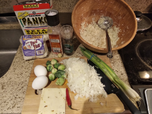

# Cauliflower Pancakes

**Ingredients:**
* Cauliflower, (and any other vegetables you like), oat flour, eggs, salt, pepper, chili pepper

**How to make it:**
* Cut everything to small pieces, shape into pancackes, and bake for 45 minutes on 400 f.
* Make a small bunny from cherry tomato.

Note: the binding agent here are the oat flour and the eggs. If you don't have them it won't shape itself into a solid form. feel free to add whatever veggies or even meat but don't skip those two.
