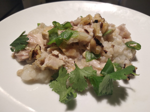

# Chicken Congee

**Ingredients:**

* 3 bone-in, skin-on chicken thighs (about 1.5 pounds total)
* 1 cup brown rice (use jasmine rice if you want the real congee)
* 4 (1/4-inch-thick) slices fresh ginger, smashed
* 2 teaspoons kosher salt, plus more as needed
* 8 cups water (for a thinner congee, add more water)

Optional toppings: (add when you serve)

* Roasted peanuts
* Thinly sliced scallions
* Minced fresh ginger
* Fresh cilantro leaves
* Tamari or soy sauce

**How to make it:**
* Put in slow cooker for 10 hours on low or 5 on high.
* Take the chicken outside of the cooker, shred it and discard bones, skin, cartilage, and ginger. Add it back to the cooker.
