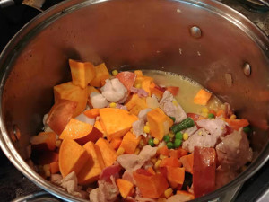

# Chicken Corn Chowder

### 1. Ingredients

* Chicken, bacon, eggs, corn, yam, veggie mix, garlic, onion, cream of mushroom, salt, pepper

### 2. How to make it

1. dice onion and sweet potato, and mince garlic
2. cut bacon to 1 inch pieces
3. cut chicken to bite size pieces
4. heat up large cooking pot on medium high, and add olive oil
5. put in garlic and onion, then wait for it to brown slightly
6. add in bacon, then wait till it brown
7. add in chicken, then wait till it's mostly cooked
8. add corn, vegetable mixed, and sweet potato
9. mix it all together
10. add water till it's about 2 inches above the food
11. turn stove to high and wait for boil
12. once boiled, turn stove to medium, then add cream of mushroom
13. once cream of mushroom is mostly dissolved, mix together 1 cup of corn starch with 1 cup of cold water
14. mix the corn starch water slowly to the pot till it's the consistansy you like
15. crack 6 eggs and beat it
16. once pot is boiling again, stir the soup slowly while pouring the egg in
17. ready and serve

### 3. Chinese

* 玉米浓汤 / Yùmǐ nóng tāng / corn soup

