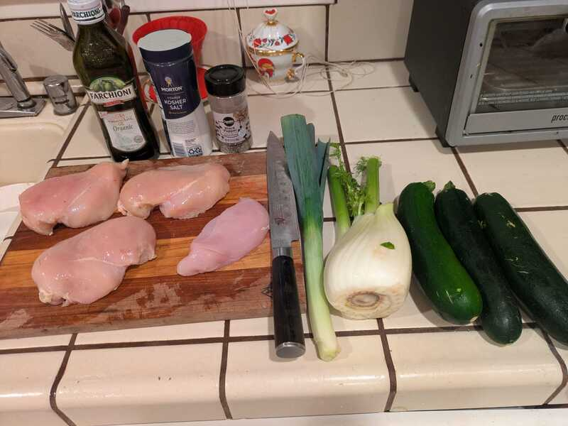
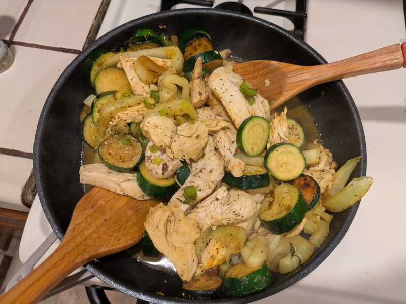

# Chicken with Fennel and Zucchini

**Summary**

Prep time: 15 mins | Cook time: 15 mins | Total time: 30 mins | Servings: 4

**Ingredients:**

- 2 tbsp extra-virgin olive oil
- 4 boneless skinless chicken breasts, cut into strips
- 1 leek, white part only, sliced thin
- 1 fennel bulb, sliced into 1/4-inch rounds
- 3 zucchini, sliced into 1/2-inch rounds
- 1/2 cup chicken broth
- 1 tsp salt
- 1/2 tsp freshly ground black pepper
- 1/2 cup sliced green olives
- 2 tbsp chopped fresh dill

**Instructions:**

1. In a large pan over high heat, heat the olive oil.
2. Add the chicken strips. Brown them for 1 to 2 minutes, stirring constantly. Transfer the chicken and its juices to a plate or bowl and set aside.
3. Add the leek, fennel, and zucchini to the pan. Sauté for 5 minutes.
4. Return the chicken and juices to the pan. Pour in the broth. Add the salt and pepper. Cover the pan and simmer for 5 minutes.
5. Remove the pan from the heat, and stir in the olives and dill.

**Tips:**

- By cutting the breast meat into strips, it cooks in no time. If your chicken is frozen, defrost it about halfway and then cut it into strips. It's easier to cut when still partially frozen.

---

Source: [The Anti-Inflammatory Diet & Action Plans](https://www.amazon.com/Anti-Inflammatory-Diet-Action-Plans-Restore/dp/1942411251)
