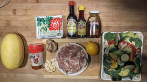
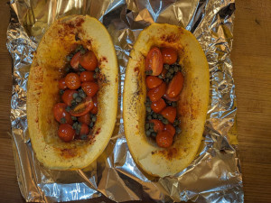
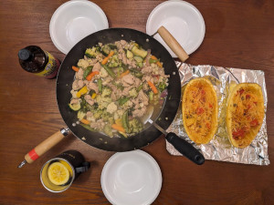

# Chicken Miso

**Ingredients:**

* chicken soy sauce, miso, seasame oil, honey, garlic, ginger, lime.

**How to make it:**

Saute chicken with everything and cook in a large pan.

Note: we baked squash with tomatoes to enjoy some healthy carbs.
