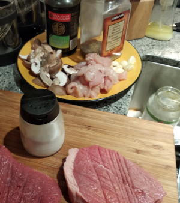
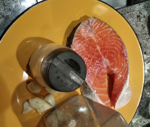
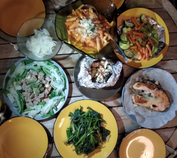

# Chicken, Salmon, and Beef

**Ingredients:**

Chicken
* Chicken, mushrooms, garlic, chilli, soy sauce

Salmon
* Salmon, salt, pepper, garlic

Beef
* Beef, onions

**How to make it:**
* Cook each dish in a skilet 

