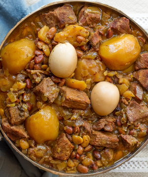

# Cholent

This is a traditional Jewish stew that you make on Friday night. I make it healthier by using yams instead of potatoes.

**Ingredients:**
* 2.5 lbs Beef or chicken, 2.5 lbs yams, 6 eggs, 1 cup beans: lima, pinto, chickpeas, red beans (not kidney), or a mixture, diced tomatoes, 2 onions, 3 garlic cloves
* 1/2 tsp black pepper, 1 tbsp salt, 1.5 tsp paprika, 1.5 turmeric, 1 tsp cumin, 1/4 cayenne, water

**How to make it:**
"put stuff together" in a slow cooker for 10 hours. Leave the eggs with the shell.

Note: add yams first, than onions, than meat, than everything else.
