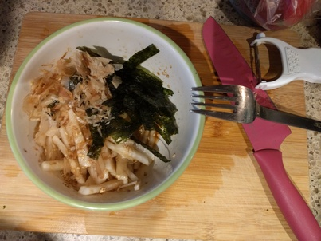

# Daikon Salad

**Ingredients:**

* Daikon (white radish)
* Sesame seeds
* Soy sauce
* Rice Vineger
* Sugar
* Sesame oil
* Bonito flake(fish flakes)
* Shredded nori seaweed

**How to make it:**

1. Put everything in a bowl.
1. Cut daikon - pile the skin and cut into thin sticks.
1. Add daikon to bowl of dressing and mix.
1. Serve with bonito flakes and nori.
