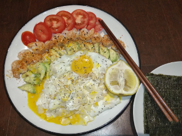

## Eggs and Avocado

**Ingredients:**
* Eggs, avocado, shrimp, radish, tomatoes, lemon, sea weed, spices

**How to make it:**
* Cook everything in a skillet.  I prefer not to cook the tomato and avocado but it's up to you.

Good job! / Zuò dé hǎo! / 做得好!

