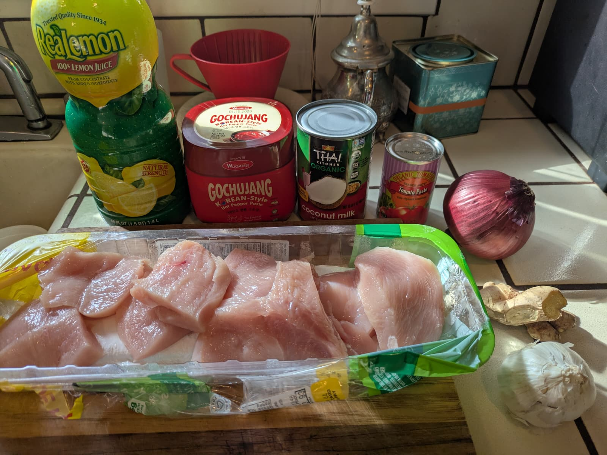
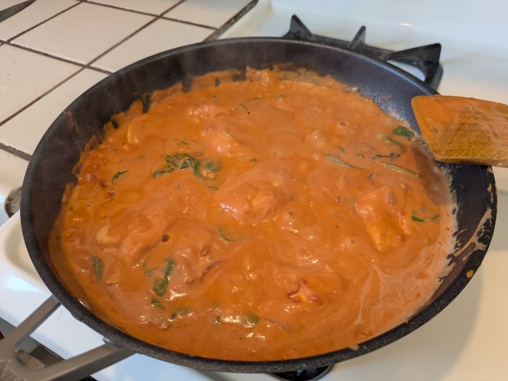

# Gochujang & coconut chicken

**Summary**

Prep time: 10 mins | Cook time: 30 mins | Total time: 40 mins | Servings: 4

**Ingredients:**

Marinade:

- 6 chicken thighs, deboned
- 3 tsp smoked paprika
- 1 tsp ginger powder
- 2 tsp gochugaru flakes
- Pinch of MSG
- Avocado oil

Sauce:

- 1 small red onion, diced
- 3 cloves garlic, diced
- 1 tbsp tomato paste
- 1 tbsp gochujang paste
- 1 400ml tin coconut milk
- 1 lime leaf
- Juice of 1/2 lime
- Coriander, optional

**Instructions:**

1. Toss chicken with the smoked paprika, ginger powder, gochugaru, MSG, and a bit of oil. Leave to marinate while you prep the onion and garlic.
2. Heat avocado oil in a shallow pan over medium heat. Fry chicken skin side down until crispy. Flip and cook a few minutes more - it doesn't need to be fully cooked through.
3. Remove chicken from the pan, leaving the juices. Add onion, tomato paste, and gochujang paste. Cook for 5 minutes until jammy. Add garlic and cook for 2 more minutes.
4. Pour in the coconut milk, add the lime leaf, and bring to a simmer. Return chicken and cook for 10 minutes or until cooked through.
5. Serve with rice, lime, and coriander.

---

Source: [Instagram](https://www.instagram.com/reels/DWOBD5QDXeU/)
