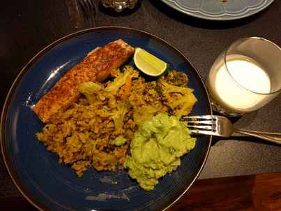

## Bengali Khichuri with Salmon

**Ingredients:**

* Khichuri: Brown rice, mung beans, onions, chillies, broccoli, trumeric, lemon
* Protein: Salmon
* Fat: Avocado, chillies, salt

**How to make it:**

* Saute rice, beans, onions, chillies, and trumeric with some oil in a pot for 5 min. Cook with instant pot/slow cooker, or on the stove. Add brocoli toward the end.
* Cook the salmon with whatever spices you like.
* Smash the avocado, chillies (cut them super thin), and salt

Serve together and squeeze the lemon on everything.
