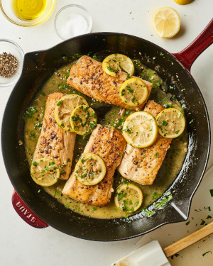

# Grilled Mahi Mahi with mojo

**Ingredients:**

Mahi mahi, olive oil, salt, pepper, garlic, 1/4 cup lime juice, cilantro, green leaves (Arugula, spinach, etc)

**How to make it:**

Grill the fish (or in skillet):
* mahi, olive oil, salt, pepper
* 5 min each side grill

Make the sauce:
* add to a bowl: lime juice, salt, cilantro
*	add to a pot: olive oil, garlic, salt. Put on stove for a few minutes until golden
*	add hot pot into the bowl

Serve:
* serve the mahi on top green leaves and drizzel the hot sauce
