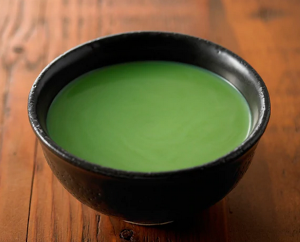

## Matcha Latte

**Ingredients:**
* 1 tsp of matcha powder
* 1 tbsp hot water
* Cup of milk (any type: regular, coconut, almond)

**Optional**
* Lemon, cinnamon, turmeric, ginger, honey

**How to make it:**

* Heat it up in the micro
* Make it foamy with frother
