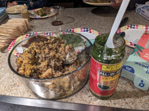

# Moroccan Chicken

**Ingredients:**
* 1 teaspoon paprika
* 1 teaspoon turmeric
* 1 teaspoon ground cumin
* 1/2 teaspoon kosher salt
* 1/4 teaspoon black pepper
* 1.5 pounds chicken thighs (6 thighs) boneless & skinless, or skin-on & bone-in
* 3 tablespoons olive oil, divided
* 2 garlic cloves, minced
* 1 small yellow onion, finely diced
* 1 teaspoon ginger, minced
* 1 cup uncooked quinoa
* 1 can (14.5 ounce) chickpeas, rinsed and drained
* 1/2 cup dried cherries
* 1.5 cups chicken broth
* optional: finely chopped cilantro leaves or parsley leaves

**How to make it:**
* In a small bowl, mix together paprika, turmeric, cumin, salt, and pepper.
* Coat chicken with spice rub as evenly as possible on all sides. Set aside on a plate.
* Add 2 tablespoons olive oil to the bottom of the Instant Pot pan.
* Press SAUTE mode on the Instant Pot.
* Add chicken to Instant Pot and sauté until slightly brown. Then flip over each piece of chicken and continue cooking until that side is slightly browned. Remove from Instant Pot and set aside on a plate.
* Add remaining 1 tablespoon olive oil to the bottom of the pot.
* Stir in garlic, onions, and ginger. Sauté for 2 minutes, stirring slowly.
* Mix in the quinoa (or couscous), dried cherries (or dried apricots), chickpeas, chicken broth, and the browned chicken.
* Close the Instant Pot lid and be sure the pressure release valve is in SEALING.
* Press POULTRY (or Manual) and set time to 10 minutes.
* Instant Pot will bring contents to pressure and the display will say ON during this time. Once the contents have reached pressure (this can take up to 10 minutes), the Instant Pot will beep and start counting down 10 minutes. At the end (when those 10 minutes are up), use tongs to very carefully turn the knob to VENTING in order to Quick Release.
* Once the float valve pin is down, and steam stops being released through the valve (this can take a few minutes; your time may vary), press CANCEL and carefully open the lid.
* Chicken is done when a thermometer inserted into the meat registers 165° F.
* Plate, garnish with optional cilantro or parsley leaves, and serve immediately.

Simplified version of [this](https://urbanblisslife.com/healthy-instant-pot-moroccan-chicken/#recipe).
