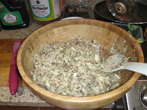

## Mung Bean Pancakes

**Ingredients:**
* Mung beans, meat or fish (whatever you want), veggies (whatever you want), Kimchi, soy sauce, rice vinegar

**How to make it:**
* Make the mung beans into a soup - instant pot for 30 minutes or on the stove
* Cut everything very tiny and bake in the over for 45 minutes at 400 f

