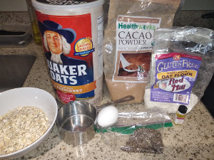
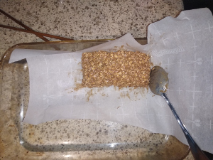

# Oatmeal Bars

**Ingredients:**
* 1 cup oatmeal, 1/2 cup oat flour, 2 eggs, cacao powder, banana, chia seeds

**How to make it:**
* Mix and bake on 350 for 30 minutes

**Nutrition:**
* 1 cup Oatmeal - calories 158, protein 6 g, fat 3.2 g,carbs 27 g
* 1/2 Oat flour - 210 calories, protein 7.5 g, fat 4.8, carbs 34 g
* 2 eggs - 144 calories, protein 12.6 g, fat 9.6 g, carbs 0.7 g
* Banana - 105 calories, protein 1.3 g, fat 0.4 g, carbs 27 g
* Total:  calories 617, protein 27.4 g, fat 18 g, carbs 88 g

好吃又健康! / Hào chī yòu jiànkāng! / yummy and healthy!

