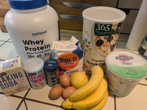
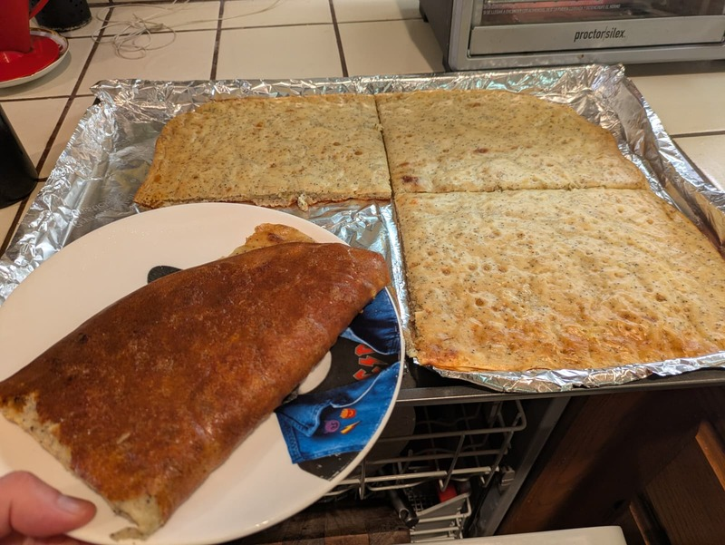

# Protein Banana-Lemon Poppyseed Muffins

**Summary**

Prep time: 15 mins | Cook time: 20 mins | Total time: 35 mins Servings: 12 muffins

**Ingredients:**

1.75 cups Oat Flour (blend approx. 2 cups of whole oats to get this)
0.5 cup Protein Powder
2 tbsp Poppyseeds (increased as per original)
1 tsp Baking Soda
1 tsp Baking Powder
0.5 tsp Salt
3 large Ripe Bananas, mashed
2 large Eggs
1 cup Plain Greek Yogurt
2 tbsp Lemon Juice
1 tbsp Lemon Zest

Note: I used all-purpose flour by accident. We'll see how it turned out...

**Instructions:**

1. Prep: Preheat oven to 375°F (190°C). Grease your muffin tin well.
1. Blend Oats: Use your hand blender in a narrow container. Blend until you have a fine powder. Measure 1 ¾ cups after blending, not before.
1. Dry Mix: Whisk the oat flour, protein powder, 2 tbsp poppyseeds, baking soda, baking powder, and salt.
1. Wet Mix: In a separate bowl, mash the bananas thoroughly. Whisk in the eggs, Greek yogurt, lemon juice, and zest.
1. The "Oat Soak": Combine wet and dry. Stir until just combined, then let the batter sit for 10 minutes. (Because we are using 100% oats and no sugar, this rest period prevents the muffins from being "mushy" in the middle).
1. Bake: Fill the tins. Bake for 18–22 minutes until a toothpick comes out clean.

**Each muffin (of 12):** 115 calories, protein 9g, fat 2.5g, carbs 16g.

---

# Lemon Protein Glaze (Bonus)

**Ingredients:**

* 0.5 cup Greek yogurt (non-fat, plain)
* 1 scoop (30g) Vanilla protein powder
* 1 tbsp Lemon juice

**How to make it:**

* Whisk the yogurt, protein powder, and lemon juice in a small bowl until completely smooth.
* If too thick, add a splash of water or lemon juice.
* Spread over cooled muffins.

**Nutrition:**

* **Total:** calories 200, protein 34g, fat 1.5g, carbs 11g.
* **Per muffin (if shared among 12):** 17 calories, protein 2.8g, fat 0.1g, carbs 0.9g.
