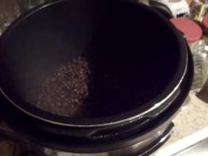
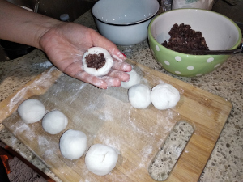

## Sesame Balls

**Ingredients:**
* Red beans, glutenous rice flour, purpule yams, hot water, olive oil, cacao powder

**How to make it:**
* Cook red beans in instant pot for 30 min, than saute for 30 min
* Bake Yams in over for an hour on 375 and blend with the beans
* Make flour using everything else, inside add the beans/yams
* Cover with add sesame and bake for 20 min on 375

** Nutrition:**
* Flour 150 g - 550 calories, protein 10 g, fat 0, carbs 120 g
* Sesame seeds 1/4 cup - calories 206, protein 6 g, fat 18 g,carbs 8 g
* Red beans 50 g - calories 115 , protein 10 g, fat 0.3 g,carbs 31 g
* Japanese Yam 50 g - calories 42, protein 1 g, fat 0 g, carbs 10 g
* Olive oil 1 tsp - calories 40, protein 0 g, fat 4.5 g,carbs 0 g
* Total:  calories 953, protein 27 g, fat 22.8 g, carbs 169 g

Each ball: 95 calories, protein 2.7, fat 2.2, cabs 16.9
