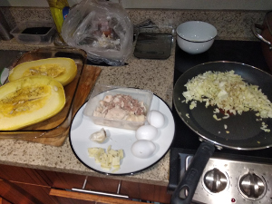
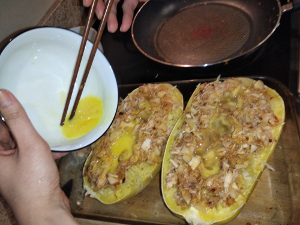
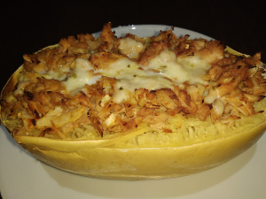

## Spaghetti Squash

**Ingredients:**
* Spaghetti squash, meat (whatever you want), veggies (whatever you want), spices

**How to make it:**
* Bake the squash for 40 min on 400
* Cut everything very tiny and bake in the over for 45 minutes at 400 f
* Stir fry whatever you want
* Add whatever on top of squash

Good job, you are awesome.

