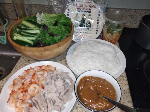
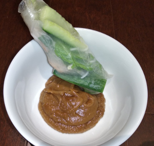

## Spring Rolls

**Ingredients:**

* Shrimps, pork belly (or other meet), wrap paper, rice sticks (vermicelli), cucumbers, lettuce, mint leaves, cilantro
* Sauce: Peanut butter, oyster sauce, garlic
* Sauce2: vinegar, daikon, carrot, vietnamese fish sauce

**How to make it:**

* Cook shrimp and pork (boil/steam/broil etc)
* Chop everything
* Wet the wrap paper and roll it with everything
* Dip in the sauce

**Sauce:**

* Add peanut butter and oyster sauce in a pot and heat it up for a few minutes

**Sauce 2:**
Mix vinegar, daikon, carrot, vietnamese fish sauce, garlic in a container and add sprinkle on the veggies
