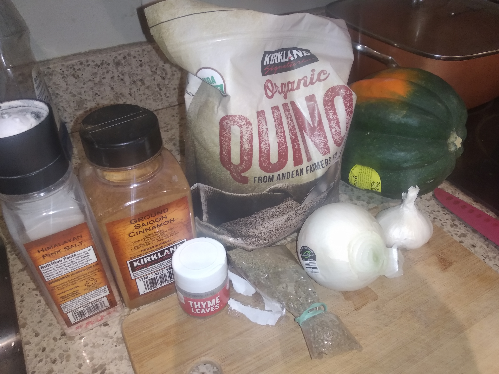

## Acron squash and quinoa

**Ingredients:**
* Acorn squash, 3 cups quinoa, 6 cups water or chicken stock, olive oil, onion, 3 garlic cloves, 1 tsp salt, 1 tsp rosemary, 1 tsp sage, 1 tsp thyme, parmesan cheese

Note: this will leave plenty of extra quinoa. Feel free to change the ratio of quinoa and water/stock.

**How to make it:**
* Satue option on instant pot. Add onion, garlic, salt
* Add quinoa, rosemary, sage, thyme and water or chicken stock
* Cut squash and put on steamer basket inside pot
* Cook 6 minutes in instant pot (with lead closed)
* Optional - add cheese, cranberries, and cinnamone
