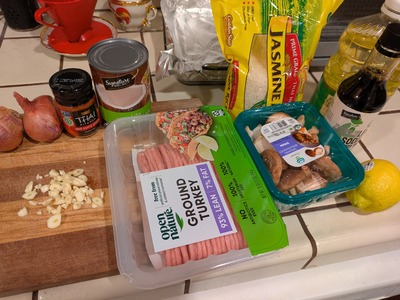
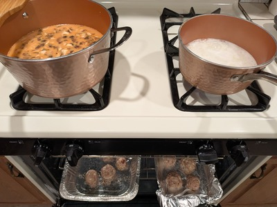
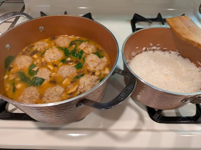

# Thai Inspired Chicken Meatball Soup

**Summary**

Prep time: 15 mins | Cook time: 25 mins | Total time: 40 mins | Servings: 4

**Ingredients:**

Meatballs:
- 1 lb ground chicken
- 2 scallions, finely chopped
- 2 tbsp cilantro, chopped
- 1 inch ginger, grated
- 3 cloves garlic, minced
- 1 tbsp soy sauce

Soup:
- 2 large shallots, thinly sliced
- 6 oz shiitake mushrooms, sliced
- 5 oz baby spinach
- 15 oz can full fat coconut milk
- 4 cups chicken stock
- 3 tbsp Thai red curry paste
- 1 tbsp soy sauce
- 1 tbsp cooking oil
- Juice of 1 lime
- Rice noodles or jasmine rice for serving

**Instructions:**

1. Preheat oven to 400°F. Line a baking sheet with parchment paper.
2. Mix ground chicken, scallions, cilantro, garlic, ginger, and 1 tbsp soy sauce. Don't overmix.
3. Form into 1.5 inch meatballs and place on baking sheet. Bake for 10 minutes (they'll finish in the soup).
4. Heat oil in a large pot over medium heat. Sauté shallots until soft, about 3 minutes.
5. Add mushrooms and cook for 2 minutes.
6. Stir in curry paste, then add coconut milk and chicken stock. Bring to a simmer.
7. Add meatballs and cook for 10 minutes until cooked through.
8. Stir in soy sauce, lime juice, and spinach. Cook until spinach wilts.
9. Serve over rice noodles or jasmine rice.

---

Source: [The Endless Meal](https://www.theendlessmeal.com/thai-inspired-chicken-meatball-soup/)
