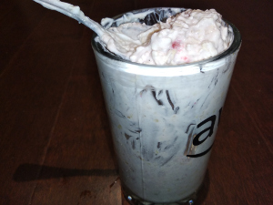

## Tony's Gainz Yogurt

**Ingredients:**
* Greek Yogurt, protein powder, oats, fruit, agave

**How to make it:**
"put stuff together"

Alternative names
* Chinese - 肌肉酸奶 / Jīròu suānnǎi / muscle yogurt
* Spanish - músculo yogur
