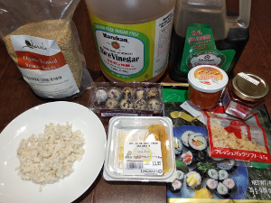

## Uni Shooters

**Ingredients:**

* Uni, ikura, tobiko, quail egg, sea weed, tobiko, rice, rice vinegar, sesame seeds, soy sauce, bonito (fish flakes)

**How to make it:**
* Hit up the rice and put everything in a shot glass or on top of the seaweed.

