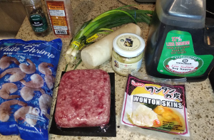
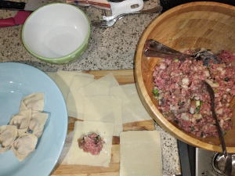
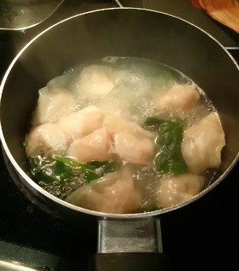

## Wonton Soup

**Ingredients:**
* Wonton skins, beef, shrimp, radish, ginger, green onions, soy sauce, salt, pepper

**How to make it:**
* Chop everything into a large bowl, stuff inside the wanton skins (use water on the edges to tie everything)
* Boil water (or chicken broth) with whatever vegetables you want (spinach, mushrooms, etc) and add wantons for a few minutes

