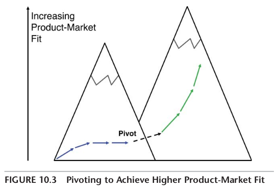

# How to improve Product-Market Fit

Don't invest in sales before you have achieved product-market fit. Spend 10 minutes sending survey email to a few customers to find if you got product-market fit.

## Step 1: Email this to a few customers
Hi [first name of a random customer that used my product twice and recently],

How would you feel if you could no longer use [product X]?

1. Very disappointed
1. Somewhat disappointed
1. Not disappointed (it isn’t really that useful)
1. N/A—I no longer use [product X]

“Please help us understand why you selected this answer”

## Step 2: Calculate product-market fit score
Products for which 40 percent or more of users reply “very disappointed” tend to have product-market fit. There can be some variability in that threshold based on the product category, but it is a good general rule of thumb.

If you achieved product-market fit, invest in trying to grow your business. If not, modify your hypotheses and your MVP so you can test them with customers again. Send the email again after making a change in your product and see if your product-market fit score improved.

## Step 3: When to pivot?

Spend a few hours on user testing of various feauters. Do 4 waves of testing and improve the product quickly. If the produc-market fit is not improving, write down a few challenges and map them to the correct layer in the Product-Market Fit Pyramid. If the challege is at a lower layer, it means that you iterating on a higher layer and you should go down. Maybe even to the base layer - your user.

Note: this is taken from the book Lean Product Playbook by Dan Olsen.
