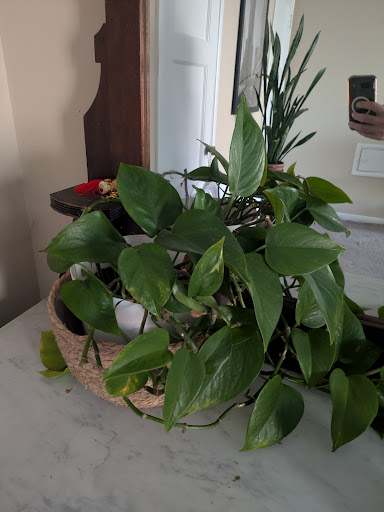
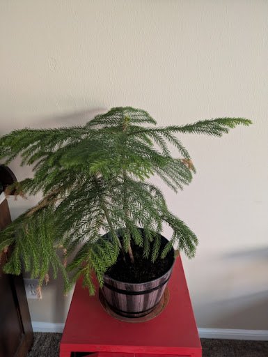
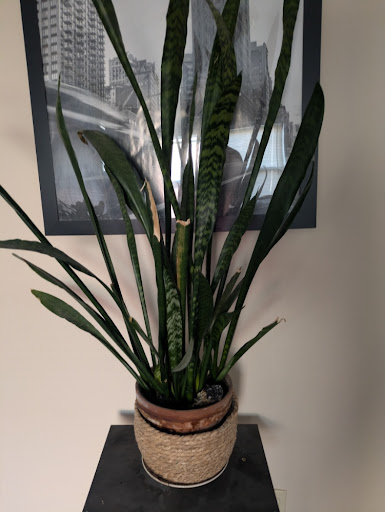
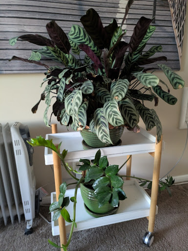

# Plants

## Pothos

Based on the heart-shaped leaves and trailing vines, you have a Pothos (Epipremnum aureum), likely the "Jade" or "Golden" variety. These are famously resilient plants, often called "Devil's Ivy" because they are so hard to kill.

Watering Guide
Pothos prefer to dry out significantly between waterings. Overwatering is the most common way to accidentally hurt them.

Frequency: Typically every 7–10 days, but this varies based on light and humidity.

The Finger Test: Stick your finger about 2 inches into the soil. If it feels dry, water it. If it still feels damp, wait a few more days.

The "Droop" Signal: Pothos are very communicative. If the leaves start to look slightly wilted or limp, it’s telling you it’s thirsty. It usually perks right back up within hours of a drink.

Quick Care Tips

| Feature | Recommendation |
|---------|----------------|
| Light | Thrives in medium to bright indirect light, but can tolerate low light. |
| Drainage | Ensure the white pot inside that basket has drainage holes. Standing water leads to root rot. |
| Yellow Leaves | A few yellow leaves near the base (like the one visible on the left) are normal aging, but many yellow leaves usually mean too much water. |
| Safety | Note: Pothos are toxic to cats and dogs if ingested, so keep those vines out of reach of curious pets. |
How much light does this spot get during the day—is it near a window or mostly in the shade?

## Norfolk Isalnd Pine

That is a Norfolk Island Pine (Araucaria heterophylla). Despite the name and appearance, it isn't a true pine; it’s actually a tropical tree.

Because of its tropical nature, its watering needs are different from the Pothos you have.

Watering Guide
This plant likes to stay consistently moist but never soggy. It does not handle drought as well as a Pothos.

Frequency: Usually every 1–2 weeks, but let the soil be your guide.

The Touch Test: Water when the top inch of soil feels dry to the touch. If the soil pulls away from the edges of the pot, it’s been dry for too long.

Drainage is Key: Ensure that the decorative bucket has drainage holes or that there is a plastic liner inside that you can take to the sink. They are very sensitive to "wet feet" (sitting in water), which causes root rot.

Critical Care Tips

| Factor | Advice |
|--------|--------|
| Humidity | This is the most important part. They love humidity. If the air is too dry, the needle-like leaves will turn brown and crunchy and fall off. A humidifier or a pebble tray nearby helps. |
| Light | They prefer bright, indirect light. If it doesn't get enough light, the lower branches may drop and will not grow back. |
| Temperature | Keep it away from cold drafts or direct heat vents. It prefers stable, room-temperature environments. |
| Growth | Be gentle with the very top tip (the "leader"). If that tip is cut or broken, the tree will stop growing upward and start looking more like a bush. |
Are you noticing any of the lower branches feeling dry or brittle, or is it mostly staying soft and green?

You said
What plant is this and how often to water it?

## Snake Plant (Dracaena trifasciata)

Also commonly known as "Mother-in-Law's Tongue." It is perhaps the most durable indoor plant you can own—it's very hard to kill, provided you don't overwater it.

Watering Guide
The number one rule for Snake Plants is: When in doubt, don't water it. These are succulents that store water in their thick, sword-like leaves.

Frequency: Typically every 3–4 weeks. In the winter or in low light, you might even go 6 weeks between waterings.

The Soil Test: The soil must be completely dry from top to bottom before you water it again. Stick a wooden skewer or your finger deep into the pot; if there is any hint of moisture, wait another week.

Method: Water around the edges of the pot. Avoid getting water into the "cup" or center where the leaves meet the base, as this can cause the plant to rot.

Quick Care Tips

| Feature | Recommendation |
|---------|----------------|
| Light | Extremely adaptable. It thrives in bright indirect light but is famous for being able to survive in very dark corners where other plants would die. |
| Temperature | It's very hardy but prefers temperatures between 70°F and 90°F. Just keep it away from freezing drafts. |
| Potting | They actually like being "root-bound" (crowded in their pot), so you don't need to repot it very often. |
| Yellowing/Softness | If the base of a leaf feels mushy or turns yellow, it is a definitive sign of overwatering. |

A Note on those Brown Tips

I see a few dry, brown tips on some of the leaves in the photo. This is usually just a sign of low humidity or physical "bruising" if people walk past and bump it. It doesn't mean the plant is dying; it's mostly a cosmetic issue.

## Top Shelf: Calathea (Prayer Plant)

Specifically, this looks like a Calathea 'Freddie' or a similar variety. These are beautiful but can be a bit "dramatic" compared to your other plants.

Watering: They like to stay consistently moist. Never let the soil dry out completely, but don't let it sit in a puddle. Water when the top half-inch of soil feels dry (usually every 5–7 days).

The "Prayer" Movement: You might notice the leaves fold up at night and open during the day; this is normal and healthy.

Pro Tip: Calatheas are sensitive to tap water chemicals. If the leaf edges get crispy and brown, try using filtered water or letting tap water sit out for 24 hours before using it.

## Bottom Shelf: ZZ Plant (Zamioculcas zamiifolia)

The ZZ plant is the ultimate "low-maintenance" companion. It has thick, waxy leaves and potato-like bulbs (rhizomes) under the soil that store water.

Watering: Very rarely. Treat this more like your Snake Plant. Water every 3–4 weeks, and only when the soil is 100% dry all the way through.

Warning: The fastest way to kill a ZZ is by watering it too often. If in doubt, skip a week.

Light: It’s incredibly hardy and can handle very low light, though it will grow faster in indirect sunlight.

